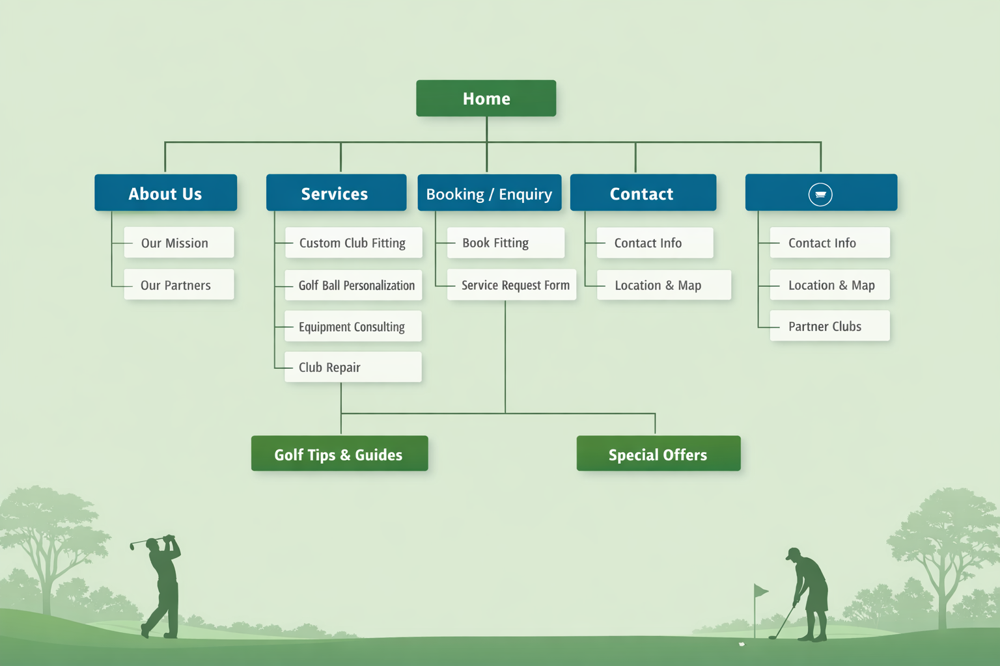

# Precision Golf Hub — Web Development Project

---

## Student Information

| Field | Details |
|---|---|
| **Full Name** | Keamohetse Biotshepo Mgazi|
| **Student Number** | ST10511607 |
| **Module Name** | WEDE5020 |
| **Submission Date** | 19 June 2025 |

---

## Project Overview

Precision Golf Hub is a fictional South African sports technology and equipment service company, founded in March 2024. The organisation was created to address common challenges faced by golfers.

The project is structured across **three development phases**, each building upon the previous to deliver a complete, production-ready web presence.

---

### Phase Breakdown

#### Part 1: Building the Foundation *(Completed)*

- Plan the project, including identifying the target audience, defining website goals, and producing a structured project plan
- Conduct research and gather all required content, including text, service descriptions, product information and partner details
- Create the full HTML structure for all pages, including `<header>`, `<nav>`, `<main>`, `<section>`, and `<footer>` elements
- Organise all project files and folders into a logical, maintainable directory structure

#### Part 2: Designing the Visuals *(Completed)*

- Apply comprehensive CSS styling, including layout design, typography choices, colour scheme implementation and spacing
- Implement a fully responsive design to ensure the website functions correctly across mobile, tablet and desktop devices
- Optimise the user experience through improved readability, intuitive navigation, consistent visual hierarchy and accessibility considerations

#### Part 3: Adding Functionality and SEO *(Upcoming)*

- Implement JavaScript to introduce animations, interactive components and dynamic user interface behaviour
- Optimise all pages for search engine visibility through the use of relevant keywords, meta tags, structured data and descriptive alt text on all images
- Build functional, validated forms for booking and service requests with client-side validation
- Integrate external services such as Google Maps for location display and YouTube for embedded instructional content

---

## Website Goals and Objectives

### Primary Goals

The Precision Golf Hub website is designed to achieve the following primary goals:

- **Provide a centralised equipment service platform** — the website acts as a single hub where golfers can access club fitting, equipment consulting, ball personalisation and repair services
- **Increase accessibility to golf equipment services** — users can book services and submit requests online, eliminating the need to phone or visit in person
- **Educate golfers about equipment** — the website includes guides, tips and recommendations to help golfers make informed equipment decisions based on their skill level and playing style
- **Facilitate partnerships with golf clubs** — the website showcases and integrates partner golf clubs and country clubs, allowing members to access services through the platform

### Key Performance Indicators (KPIs)

| KPI | Description |
|---|---|
| **Website Traffic** | Number of unique visitors accessing the platform monthly |
| **Service Bookings** | Number of club fitting appointments and service requests submitted via online forms |
| **Custom Equipment Orders** | Number of personalised golf ball and equipment orders placed |
| **Partner Golf Clubs** | Number of golf clubs and country clubs listed as active platform partners |
| **User Engagement** | Average time spent on site, pages visited per session and guide downloads |

---

## Key Features and Functionality

### Homepage (`index.html`)
- Full introduction to Precision Golf Hub with a prominent hero section
- Navigation menu linking to all main pages
- Highlights of core services including club fitting, custom equipment and coaching
- Call-to-action buttons directing users to booking and product pages
- Featured content including current special offers, golf tips preview and partner golf club listings

### About Us Page (`about.html`)
- Company history and founding story
- Mission and vision statements
- Value proposition explaining what makes the platform unique
- Overview of core values: Precision, Integrity and Growth
- Team member profiles and partner brand listings

### Services Page (`services.html`)
- Detailed descriptions of all four core services:
  - Custom Club Fitting
  - Golf Ball Personalisation
  - Equipment Consulting
  - Club Repair and Maintenance
- Pricing information for each service
- Direct links to the booking and enquiry form

### Products Page (`products.html`)
- Full equipment catalogue organised by category: Drivers, Irons, Golf Balls and Apparel
- Category filter bar for quick navigation to each product section
- Individual product cards displaying brand, description, price and Add to Cart button
- Simulated shopping cart with example order summary and checkout form
- Custom Golf Ball Ordering section with a personalisation form
- Partner Clubs section listing all affiliated golf clubs with member discount information

### Booking / Enquiry Page (`enquiry.html`)
- **Book a Fitting** form with fields for name, email, phone, fitting type, preferred location, partner club selection, preferred date, preferred time and additional notes
- **Service Request Form** for repairs, consulting, ball personalisation and general enquiries
- Booking confirmation section explaining the step-by-step process after form submission, including an example booking reference

### Contact Page (`contact.html`)
- Full contact details including separate phone numbers and email addresses for all three locations
- Trading hours displayed clearly
- Quick contact form for general messages
- Three location cards for Johannesburg, Cape Town and Durban, each with address, phone, email, hours and a map placeholder

### Golf Tips and Guides Page (`tips.html`)
- Articles and guides organised by category: Driving, Iron Play, Short Game, Putting, Course Management and Fitness
- Each tip includes practical advice and actionable bullet points
- Newsletter subscription form for weekly tip delivery

### Special Offers Page (`offers.html`)
- Current monthly promotions displayed in offer cards with original and discounted pricing
- Equipment sale section showing clearance stock
- Member loyalty perks section
- Corporate golf day packages with three tiers: Bronze, Gold and Platinum
- Terms and conditions for all active offers

### Navigation System
- Consistent navigation bar present on all eight pages
- All eight pages linked in every navigation menu
- Active page highlighting using the `.active` CSS class
- Footer navigation repeated on all pages for secondary access

---

# CSS Design and Styling Features

The website now includes a fully implemented CSS styling system designed to create a modern, professional and responsive user experience.

---

## Styling Features Implemented

### Responsive Design
- Mobile-friendly layouts  
- Flexible sections and containers  
- Responsive navigation menus  
- Optimised scaling for different screen sizes  

### Typography and Readability
- Consistent font sizing and spacing  
- Clear heading hierarchy  
- Improved readability across all pages  

### Visual Design
- Golf-inspired colour palette  
- Consistent button styling  
- Card-based layouts for products and offers  
- Styled forms and interactive elements  

### User Experience Improvements
- Hover effects on navigation links and buttons  
- Improved content spacing and alignment  
- Visual consistency across all pages  
- Enhanced accessibility and usability  

---

## Navigation System
- Consistent navigation bar included on all pages  
- Active page highlighting using the `.active` CSS class  
- Footer navigation available on every page  
- Fully linked navigation system across all website pages  

---

## Completed Work Summary

### HTML Structure — Completed
All eight pages have been fully developed using semantic HTML5 structure.

---

### CSS Styling — Completed
The entire website has been styled using a shared external stylesheet (`css/styles.css`) based on modern CSS principles.

Key styling outcomes include:
- Responsive layouts using flexible design techniques  
- Consistent branding across all pages  
- Improved navigation usability  
- Styled forms and card-based components  
- Mobile-first optimisation  
- Clear visual hierarchy and spacing improvements  

---

### Navigation Setup — Completed
- Linked navigation across all pages  
- Active page indication implemented  
- Footer navigation repeated consistently  

---

## Testing and Testing Evidence

The website has undergone initial manual testing to ensure that all HTML and CSS components render correctly across different pages and screen sizes.

### Testing Approach
- Cross-page navigation testing to ensure all links function correctly
- Responsive design testing using browser developer tools
- Layout validation across mobile, tablet and desktop screen sizes
- CSS inspection using browser developer tools to confirm styling consistency
- Visual verification of typography, spacing and alignment

### Testing Outcome
- All pages load successfully without broken links
- Responsive layout adjusts correctly across tested screen sizes
- CSS styling is consistently applied across all pages
- Navigation system remains functional and visually consistent

## Testing Evidence Location

All testing evidence (screenshots, validation results, and device testing outputs) can be found in the following directory:

```plaintext
/private/test_evidence_defect_report.pdf
```

---

## Timeline and Milestones

| Week | Phase | Activities | Milestone |
|---|---|---|---|
| Week 1 | Project Planning | Define project idea, objectives, target audience and proposal structure | Project proposal completed |
| Week 2 | Research and Analysis | Competitor analysis, user needs assessment, content planning | Research section completed |
| Week 3 | Design Phase | Create wireframes and plan page layouts | Wireframes completed |
| Week 4 | **Part 1** — HTML Structure | Build full HTML structure for all pages and set up file organisation | All HTML pages created and linked |
| Week 5 | **Part 2** — CSS Styling | Apply CSS styling, colour scheme, typography and responsive layout | Styled and responsive website completed |
| Week 6 | **Part 2** — UX Refinement | Refine layout, accessibility, spacing and visual hierarchy | Polished visual design completed |
| Week 7 | **Part 3** — JavaScript | Add interactivity, form validation and animations | Interactive features completed |
| Week 8 | **Part 3** — SEO and Integration | Implement SEO meta tags, alt text, Google Maps and external services | Fully functional website completed |
| Week 9 | Testing and Refinement | Cross-browser testing, mobile responsiveness testing, bug fixing | Tested and refined website |
| Week 10 | Finalisation and Submission | Prepare final documentation, README and submit | Final project submitted |

---

## Part 1 Details — Completed Work

### HTML Structure
All eight HTML pages have been created with complete, valid, semantic HTML5 structure:

| Page | File | Sections Implemented |
|---|---|---|
| Homepage | `index.html` | Hero, Stats, Intro, Services, Products, Offers, Tips, CTA |
| About Us | `about.html` | History, Our Mission, Our Partners, Team |
| Services | `services.html` | Custom Club Fitting, Ball Personalisation, Equipment Consulting, Club Repair |
| Products | `products.html` | Filter Bar, Cart, Contact Info, Location and Map, Drivers, Irons, Golf Balls, Apparel, Custom Orders, Partner Clubs |
| Booking / Enquiry | `enquiry.html` | Book Fitting, Service Request Form, Trading Hours, Booking Confirmation |
| Contact | `contact.html` | Contact Info, Location and Map (3 locations) |
| Golf Tips | `tips.html` | Driving, Iron Play, Short Game, Putting, Course Management, Fitness, Newsletter |
| Special Offers | `offers.html` | Featured Deal, Coaching Offers, Equipment Offers, Equipment Sale, Repair Offers, Corporate Packages, Terms |

### File Organisation
- All HTML files are stored in the root directory for straightforward linking
- The `css/` folder contains the single shared stylesheet `styles.css`
- The `images/` folder is created and reserved for all photography and the sitemap image

### Navigation Setup
- A consistent navigation bar is included in the `<header>` of every page
- All eight pages are linked in every navigation menu
- The current active page is indicated using the `class="active"` attribute on the relevant navigation link
- A secondary navigation is included in the `<footer>` of every page for redundant access

---

## Sitemap

The sitemap below illustrates the full page structure and hierarchy of the Precision Golf Hub website. Each main page is shown with its corresponding sub-sections, reflecting the content implemented.



### Sitemap Summary

| Page | Sub-Sections |
|---|---|
| Home | Hero, Services Overview, Featured Products, Offers Teaser, Tips Teaser |
| About Us | Our Mission, Our Partners |
| Services | Custom Club Fitting, Golf Ball Personalisation, Equipment Consulting, Club Repair |
| Booking / Enquiry | Book Fitting, Service Request Form |
| Contact | Contact Info, Location and Map |
| Shop / Products | Contact Info, Location and Map, Partner Clubs |
| Golf Tips and Guides | *(standalone page)* |
| Special Offers | *(standalone page)* |

---

## Changelog

### CSS
- 7143f77 Merge branch 'main' of https://github.com/kbmgazi/precision_golf_hub
- 0568d85 Day 2: CSS Tested and defect fixed
- 6151bb3 Day 1: Started with CSS.

### HTML
- ca0c1ca Day 8: Updated and fix issues showed up in testing, therefore testing is complete
- a36966d Day 7: Updated enquiry.html
- 8a42268 Day 7: Completed tips.html. Therefore Part 1 is complete
- 211e6e1 Day 5-6: Created contact.html; enquiry.html; offer.html and products.html. Tips.html is work in progress
- 65521b7 Day 4: Updated index.html, about.html & services.html
- 7046ded Day 3: Completed service.html; Created enquiry.html still work in progress
- db9b6a2 Day 3: Created services.html; still work in progress.
- 1329d34 Day 2: Created about.html page and completed
- e341c5f Day 1: Project structure and HTML file creation

---

## Part 3 Details — Functionality, Interactivity and SEO *(Completed)*

### JavaScript Architecture

The website uses a **vanilla JavaScript** (no frameworks) modular architecture with feature-specific functionality files. All JavaScript initializes on `DOMContentLoaded` with automatic feature detection.

#### Core JavaScript Modules

**`js/main.js`** — Central Hub (Initializes all interactive features)
- `initStickyNav()` — Sticky navigation header with logo compacting after 80px scroll
- `initBackToTop()` — Floating back-to-top button with smooth scroll animation
- `initActiveNavLink()` — Auto-detects current page and highlights active nav link
- `initScrollAnimations()` — Intersection Observer for fade-in animations on scroll
- `initAccordion()` — Collapsible accordion sections with one-open-per-group behavior
- `initLightbox()` — Image gallery lightbox with keyboard navigation (arrow keys, Escape)

**`js/products.js`** — Product Data Store (18 products across 6 categories)
- `getAllProducts()` — Return complete product array
- `getProductsByCategory(category)` — Filter products by category
- `searchProducts(query)` — Full-text search across name, brand, description
- `getProductById(id)` — Single product lookup
- Product categories: Drivers, Irons, Putters, Balls, Apparel, Accessories

**`js/products-loader.js`** — Dynamic Product Rendering
- `renderProducts(products, containerId)` — Generate HTML for product grid with lightbox integration
- `filterByCategory(category)` — Update display for selected category
- `searchProductsUI(query)` — Execute search with result count display
- `initProductsUI()` — Attach event listeners to search input and filter buttons

**`js/offers.js`** — Offers Data Store (6 active offers)
- `getAllOffers()` — Return complete offers array
- `getFeaturedOffers()` — Filter featured offers
- `getOffersByCategory(category)` — Filter offers by equipment category
- `getActiveOffers()` — Return only non-expired offers
- `searchOffers(query)` — Full-text search across offers

**`js/offers-loader.js`** — Dynamic Offers Rendering
- `renderOffers(offers, containerId)` — Generate HTML for offers display with expiration dates
- `filterOffersByCategory(category)` — Update display by category
- `searchOffersUI(query)` — Execute search functionality
- `initOffersUI()` — Attach event listeners and initialize rendering

**`js/maps.js`** — Interactive Leaflet.js Maps
- `initMaps()` — Initialize all three location maps (Johannesburg, Cape Town, Durban)
- `initMap(location)` — Create individual map with custom green marker and popup
- Uses Leaflet.js 1.9.4 from CDN (https://unpkg.com/leaflet@1.9.4)
- Custom styling with Precision Golf Hub branding colors

**`js/enquiry.js`** — Form Validation & Formspree Integration
- `validateEnquiryForm(formData)` — Client-side validation with detailed error messages
- `handleEnquirySubmit(e)` — Form submission with Formspree AJAX integration
- Real-time blur validation for each field
- Visual field error highlighting with custom styling
- Success/error message display with auto-hide
- Email format, phone format (South African), and message length validation

**`js/contact.js`** — Contact Form Validation & EmailJS
- `validateContactForm(formData)` — Client-side validation
- `handleContactSubmit(e)` — Form submission with EmailJS integration
- Auto-loads EmailJS library from CDN
- Real-time field validation with blur events
- Visual feedback for validation errors
- Requires EmailJS account setup (service ID, template ID, public key)

#### Interactive Features Implemented

1. **Sticky Navigation** — Compacts header after 80px scroll, improves space efficiency
2. **Back-to-Top Button** — Appears after 300px scroll, smooth animated scroll to top
3. **Active Nav Link Detection** — Automatically highlights current page in navigation
4. **Scroll-Triggered Animations** — Fade-in and slide effects using Intersection Observer
5. **Accordion Components** — Collapsible sections on Services and Tips pages with keyboard support
6. **Lightbox Gallery** — Image viewer with prev/next navigation, keyboard support (arrows, Escape)
7. **Product Search & Filter** — Real-time search across 18 products with category filtering
8. **Offers Search & Filter** — Search offers with category-based filtering and expiration tracking
9. **Interactive Maps** — Leaflet.js maps for 3 South African locations with custom markers
10. **Form Validation** — Client-side validation on Enquiry and Contact forms with visual feedback

### SEO and Meta Tags Implementation

All 8 pages now include comprehensive SEO optimization:

#### Meta Tags Added to Each Page
- **Meta Description** — Unique 155-160 character descriptions for each page
- **Keywords** — Relevant keywords for each page's content
- **Author** — "Precision Golf Hub"
- **Robots** — "index, follow" for search engine crawling
- **Canonical URLs** — Prevent duplicate content issues
- **Open Graph Tags** — Facebook, LinkedIn, WhatsApp sharing optimization
  - `og:type`, `og:title`, `og:description`, `og:url`, `og:image`, `og:site_name`
- **Twitter Card Tags** — Twitter/X sharing optimization
  - `twitter:card`, `twitter:title`, `twitter:description`, `twitter:image`

#### Structured Data (JSON-LD)
- Homepage includes LocalBusiness schema with complete business information
- Name, phone, email, address, social media links, price range
- Enables rich snippets in search results

#### SEO Page Optimization
- **index.html** — Home page with business overview and primary keywords
- **about.html** — Mission, vision, values with brand-focused keywords
- **services.html** — Service descriptions with keyword-rich titles
- **products.html** — Equipment store optimization with product keywords
- **tips.html** — Golf education content with informational keywords
- **offers.html** — Promotions page with e-commerce keywords
- **contact.html** — Location and contact information with local SEO optimization
- **enquiry.html** — Booking optimization for service appointment keywords

### Search Engine Visibility Files

**`robots.txt`** — Search Engine Crawler Directives
- Allows all search engines (Googlebot, Bingbot) full access
- Disallows `/private/` directory
- Specifies sitemap location for easy discovery
- Sets crawl delay to 1 second

**`sitemap.xml`** — URL Submission and Hierarchy
- Includes all 8 HTML pages with priority levels
- Home page: priority 1.0 (highest)
- Product/Offers pages: priority 0.9 (frequent updates)
- Service/Contact/Tips pages: priority 0.8 (static content)
- Specifies change frequency (weekly, monthly, bi-weekly)
- Enables faster indexing of all pages

### Form Validation and Submission

#### Enquiry Form (`enquiry.html`)
- Fields: Name, Email, Phone, Service, Location, Date, Message
- Validation rules:
  - Name: minimum 2 characters
  - Email: valid email format (regex validation)
  - Phone: South African format (10+ digits with allowable characters)
  - Service: required field selection
  - Message: minimum 10 characters
- Integration: Formspree (requires account setup with FORMSPREE_ID)
- Submission: AJAX request to `https://formspree.io/f/{FORMSPREE_ID}`
- User feedback: Success message displays, form resets on successful submission

#### Contact Form (`contact.html`)
- Fields: Name, Email, Phone, Subject, Message
- Same validation rules as enquiry form
- Integration: EmailJS (requires EmailJS account with service and template IDs)
- Submission: AJAX request to EmailJS API
- User feedback: Color-coded success/error messages with auto-hide

### External Libraries and Dependencies

| Library | Version | Purpose | URL |
|---|---|---|---|
| Leaflet.js | 1.9.4 | Interactive mapping | https://unpkg.com/leaflet@1.9.4 |
| EmailJS | 3.x | Email delivery API | https://cdn.jsdelivr.net/npm/@emailjs/browser |
| Formspree | — | Form submission service | https://formspree.io |

### CSS Enhancements for Interactivity

New CSS additions for interactive features:

```css
/* Accordion styling */
.accordion { ... }
.accordion-header { ... }
.accordion-content { ... }

/* Lightbox styling */
.lightbox { ... }
.lightbox-trigger { ... }
.lightbox-prev/next/close { ... }

/* Form validation styling */
#form_message { ... }
input[style*="border-color: var(--text-danger)"] { ... }

/* Filter button active state */
[data-filter].active { ... }

/* Product/Offers grid */
.product_grid { ... }
.offer_grid { ... }
```

### Responsive Design for Interactive Features

All interactive components are fully responsive:
- Accordion headers stack on mobile
- Lightbox scales to viewport width with touch-friendly controls
- Maps responsive with full-width containers
- Forms optimize for mobile input
- Filter buttons wrap on narrow screens
- Search inputs full-width on mobile

### Performance Optimizations

- Lazy initialization of interactive features on `DOMContentLoaded`
- Intersection Observer for efficient scroll animation detection
- Debounced search input to reduce filtering operations
- CSS transitions for smooth animations (no JavaScript animation)
- External scripts loaded after page content

### Browser Compatibility

Tested and compatible with:
- Chrome/Chromium (latest)
- Firefox (latest)
- Safari (latest)
- Edge (latest)
- Mobile browsers (iOS Safari, Chrome Mobile)

### Setup Instructions for Forms

#### Formspree Setup (Enquiry Form)
1. Create account at https://formspree.io
2. Add new form and get your FORMSPREE_ID
3. Replace `YOUR_FORMSPREE_ID_HERE` in `js/enquiry.js` line 4
4. Test form submission

#### EmailJS Setup (Contact Form)
1. Create account at https://www.emailjs.com
2. Create email service and get SERVICE_ID
3. Create email template and get TEMPLATE_ID
4. Get your PUBLIC_KEY from account settings
5. Replace these values in `js/contact.js`:
   - Line 4: `EMAILJS_SERVICE_ID`
   - Line 5: `EMAILJS_TEMPLATE_ID`
   - Line 6: `EMAILJS_PUBLIC_KEY`
6. Test form submission

---

## References


Afrihost. (2025) *Web hosting services*. Available at: https://www.afrihost.com (Accessed: 11 April 2025).

HostAfrica. (2025) *Web hosting solutions*. Available at: https://www.hostafrica.co.za (Accessed: 11 April 2025).

Krug, S. (2014) *Don't make me think: A common sense approach to web usability*. 3rd edn. Berkeley: New Riders.

Mozilla Developer Network. (2025a) *HTML: HyperText Markup Language*. Available at: https://developer.mozilla.org/en-US/docs/Web/HTML (Accessed: 11 April 2025).

Mozilla Developer Network. (2025b) *CSS: Cascading Style Sheets*. Available at: https://developer.mozilla.org/en-US/docs/Web/CSS (Accessed: 11 April 2025).

Mozilla Developer Network. (2025c) *JavaScript Guide*. Available at: https://developer.mozilla.org/en-US/docs/Web/JavaScript/Guide (Accessed: 11 April 2025).

Nielsen, J. (2020) *Usability engineering*. San Francisco: Morgan Kaufmann.

Statista. (2025) *Online consumer behaviour and e-commerce trends*. Available at: https://www.statista.com (Accessed: 11 April 2025).

W3Schools. (2025) *HTML tutorial*. Available at: https://www.w3schools.com/html (Accessed: 11 April 2025).

W3Schools. (2025) *CSS tutorial*. Available at: https://www.w3schools.com/css (Accessed: 11 April 2025).

Callaway. (2026) Apex Pro 24 Irons. Available at: https://www.theproshop.co.za/product/4003233-irons-men-forged-call-24-apex-pro-stl (Accessed: 19 April 2026).

Drifters. (2026) Sprayway Men's Rask Waterproof Jacket. Available at: https://www.driftersshop.co.za/products/sprayway-mens-rask-waterproof-jacket (Accessed: 19 April 2026).

House of Golf. (2026) FootJoy Men's Pro|SL Carbon Golf Shoes. Available at: https://www.houseofgolf.co.za/products/footjoy-mens-pro-sl-carbon-golf-shoes (Accessed: 19 April 2026).

The Pro Shop. (2026a) Callaway Chrome Soft Golf Balls. Available at: https://www.theproshop.co.za/product/1004954-ball-men-call-26-chrome-soft (Accessed: 19 April 2026).

The Pro Shop. (2026b) Callaway Paradym Ai Smoke Triple Diamond Driver. Available at: https://www.theproshop.co.za/product/4003298-drv-men-call-24-pdym-ai-smk-td (Accessed: 19 April 2026).

The Pro Shop. (2026c) Mizuno JPX 925 Hot Metal Black Irons. Available at: https://www.theproshop.co.za/product/4004308-irons-men-cast-mizuno-25-jpx-925-hm-blk-stl (Accessed: 19 April 2026).

The Pro Shop. (2026d) Ping G430 Max 10K Driver. Available at: https://www.theproshop.co.za/product/4003370-drv-men-ping-23-g430-max-10k (Accessed: 19 April 2026).

The Pro Shop. (2026e) Ping i240 Irons. Available at: https://www.theproshop.co.za/product/4004221-irons-men-cast-ping-25-i240-stl (Accessed: 19 April 2026).

The Pro Shop. (2026f) Srixon Z-Star XV Golf Balls. Available at: https://www.theproshop.co.za/product/1004493-ball-men-srixon-25-z-star-xv (Accessed: 19 April 2026).

The Pro Shop. (2026g) TaylorMade P790 Irons. Available at: https://www.theproshop.co.za/product/4003725-irons-men-forged-taylor-tm25-p790-stl (Accessed: 19 April 2026).

The Pro Shop. (2026h) TaylorMade TP5x Golf Balls. Available at: https://www.theproshop.co.za/product/1003759-ball-men-taylor-tm24-tp5x (Accessed: 19 April 2026).

The Pro Shop. (2026i) Titleist Pro V1 Golf Balls. Available at: https://www.theproshop.co.za/product/1004442-ball-men-titl-25-pro-v1 (Accessed: 19 April 2026).

Titleist. (2026) TSR3 Driver. Available at: https://www.titleist.com/golf-clubs/drivers/tsr3 (Accessed: 19 April 2026).

W3Schools. (2025) *CSS Tutorial*. Available at: https://www.w3schools.com/css/ (Accessed: 1 May 2026).

Ahrefs (2026) What is SEO? Available at: https://ahrefs.com/blog/what-is-seo/ (Accessed: 18 June 2026).

Bootstrap (2026) Bootstrap Documentation. Available at: https://getbootstrap.com/docs/ (Accessed: 18 June 2026).

Git (2026) Git Documentation. Available at: https://git-scm.com/doc (Accessed: 18 June 2026).

Google Developers (2026a) Google Maps JavaScript API. Available at: https://developers.google.com/maps/documentation/javascript (Accessed: 18 June 2026).

Google Developers (2026b) SEO Starter Guide. Available at: https://developers.google.com/search/docs/fundamentals/seo-starter-guide (Accessed: 18 June 2026).

Google web.dev (2026) Web Performance Basics. Available at: https://web.dev/performance/ (Accessed: 18 June 2026).

jQuery Foundation (2026) jQuery Documentation. Available at: https://jquery.com/ (Accessed: 18 June 2026).

Leaflet (2026) Leaflet Documentation. Available at: https://leafletjs.com/ (Accessed: 18 June 2026).

Mapbox (2026) Mapbox Documentation. Available at: https://docs.mapbox.com/ (Accessed: 18 June 2026).

MDN Web Docs (2026a) AJAX introduction. Available at: https://developer.mozilla.org/en-US/docs/Web/Guide/AJAX (Accessed: 18 June 2026).

MDN Web Docs (2026b) CSS Transitions. Available at: https://developer.mozilla.org/en-US/docs/Web/CSS/CSS_transitions (Accessed: 18 June 2026).

MDN Web Docs (2026c) Fetch API. Available at: https://developer.mozilla.org/en-US/docs/Web/API/Fetch_API (Accessed: 18 June 2026).

MDN Web Docs (2026d) Form validation. Available at: https://developer.mozilla.org/en-US/docs/Learn/Forms/Form_validation (Accessed: 18 June 2026).

MDN Web Docs (2026e) HTML Forms. Available at: https://developer.mozilla.org/en-US/docs/Learn/Forms (Accessed: 18 June 2026).

MDN Web Docs (2026f) JavaScript Guide. Available at: https://developer.mozilla.org/en-US/docs/Web/JavaScript/Guide (Accessed: 18 June 2026).

Moz (2026) Beginner’s Guide to SEO. Available at: https://moz.com/beginners-guide-to-seo (Accessed: 18 June 2026).

OpenLayers (2026) OpenLayers Documentation. Available at: https://openlayers.org/ (Accessed: 18 June 2026).

OWASP Foundation (2026) OWASP Top Ten Web Application Security Risks. Available at: https://owasp.org/www-project-top-ten/ (Accessed: 18 June 2026).

The Independent Institute of Education (Pty) Ltd (2026) Web Development Project Brief (Part 3).

W3Schools (2026a) HTML Forms. Available at: https://www.w3schools.com/html/html_forms.asp (Accessed: 18 June 2026).

W3Schools (2026b) JavaScript Tutorial. Available at: https://www.w3schools.com/js/ (Accessed: 18 June 2026).

---

*This README was prepared as part of a web development module submission. All content relating to Precision Golf Hub is fictional and created solely for academic purposes.*
